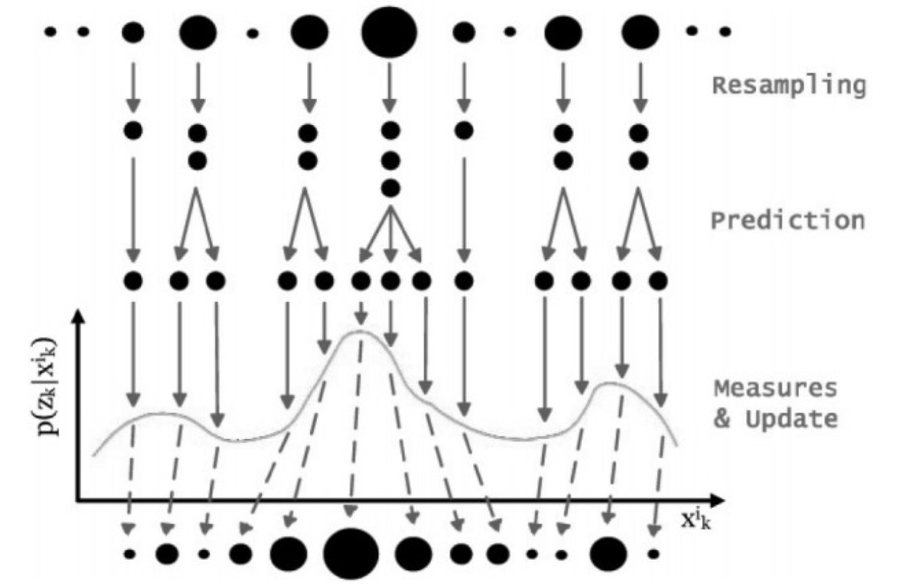

---
layout: post
title: Particle filter
subtitle: 마우스 이벤트를 사용한 파티클 필터 구현
gh-repo: daattali/beautiful-jekyll
#gh-badge: [star, fork, follow]
#cover-img: /assets/img/git_home.jpg
thumbnail-img: /assets/img/particle_icon.png
#share-img: /assets/img/git_home.jpg
tags: [MachineLearning]
comments: true
---  

### 파티클 필터의 동작원리와 예제

파티클 필터(particle filter)는 비선형 상태에서 노이즈가 많은 환경에서 측정된 데이터를 필터를 사용해 실제 위치를 추정하는 도구다. 파티클 필터(particle filter)는 보통 가우시안 분포가 아닌 관측 데이터들을 기준으로 사용된다고 한다. 물론 가우시안 분포의 데이터에서 사용하지 말라는 건 아니다. 

본 포스트에서는 파티클 필터(particle filter)의 어려운 수학적인 내용은 제하고, 쉽게 예를 들며 필터의 동작원리에 대해 알아보았다.

파티클 필터(particle filter)에 대해 검색해 보면 아래와 같은 그림을 많이 보게 된다. 아래 그림은 파티클 필터의 estimation cycle을 도식화한 것이다.


<자료: Particle Filter Based Monitoring and Prediction of Spatiotemporal Corrosion Using Successive Measurements of Structural Responses>

위의 검은 원들 하나하나가 particle을 의미하고 하나하나의 객체의 특성을 띄고있다. 객체의 특성으로는 위치 데이터 (x,y,z)와 weight (가중치)를 가지고 있다.
그림에서 큰 검은원과 작은 원의 차이는 weight가 큰 값을 가진 파티클은 큰 검은원, weight가 작은 값을 가진 파티클은 작은 검은원을 뜻한다.

```
class particle
{
    double x;
    double y;
    double weight;
}
```
<br>

이제부터 마우스 이벤트를 사용한 파티클 필터를 구현 과정에 대해 설명한다. (구현 순서는 위 그림과 조금 다를 수 있다.)

### 1. initalize particle

측정 범위는 Opencv에 Mat class를 사용하여 일정 범위 500x500 사이즈의 Map 안에 N개의 파티클들의 좌표를 랜덤하게 주었다. 이때, 각각의 파티클들의 weight는 모두 0으로 한다.

```
for(int i = 0; i < particle_count; i++)
{
   particle[i].x = random(0, range);
   particle[i].y = random(0, range);
   particle[i].weight = 0;
}
```

<br>

### 2. Prediction

Prediction 단계는 타겟이 어떻게 움직일지 예측하는 단계로, 각각의 particle들이 현재 위치에서 (motion variance + 가우시안 랜덤[-1,1])에 해당하는 거리를 움직인다고 추정한다. 그리고, 이때 particle의 weight는 0으로 리셋한다. 

하지만, 지금은 motion variance를 제외한 노이즈만을 섞어줌으로써 각각의 파티클들의 기존위치에서 random motion을 만들어준다. 대게 로봇의 Localization에서 motion variance로 로봇의 이동경로를 더해준다.

```
for(int i = 0; i < particle_count ; i++)
{
   particle[i].x = particle[i].x + gaussian_random();
   particle[i].y = particle[i].y + gaussian_random();
   particle[i].weight = 0;
}
```

<br>

### 3. Measure & Update / Observation model

3단계 Measure & Update에서는 2단계에서 예측된 particle의 위치와 센서로 측정된 위치 데이터를 이용해 particle들의 weight를 업데이트 하는 과정이다. particle의 weight는 측정대상의 위치와 particle의 위치 차이를 이용해 구할 수 있다. 

우리의 Observation model은 mouse click point 이며, 500x500 Mat안에서 마우스의 클릭 위치를 기준으로 원을 그려 원 안에 들어가 있는 particle들의 weight는 올려주고 원 밖에 존재하는 particle들의 weight는 낮춰주는식으로 진행한다.

```
if (mouse_event_click_flag)
{
    if (click_point.x > 0 && click_point.y > 0)
    {
        cv::circle(map, cv::Point(click_point.x, click_point.y), Observation_range, cv::Scalar(255, 0, 0), 1, -1, 0);
        cv::circle(map, cv::Point(click_point.x, click_point.y), 1, cv::Scalar(0, 255, 0), 4, -1, 0);
    }

    //Step.3 Observation model
    Circle_check(&click_point, init_particle_vector, init_map);
    init_particle_vector = Normalize_Particle_Weight(init_particle_vector);
}
```

Circle_check 함수를 만들어 circle 안에 들어있는 particle들의 weight들은 높여주고, circle 밖에 있는 particle들의 weight들은 낮춰준다. 그 이후에 모든 파티클들의 weight들을 정규화 진행한다.
정규화를 왜 해야하는지에 대해서는 다음 포스트에 작성하겠다.

<br>

### 4. Resampling

resampling 과정은 쉽게 설명하면, weight가 작은 particle은 지워 버리고, weight가 큰 particle은 복사해 여러 개로 만드는 과정이다. resampling 전후의 particle개수는 동일해야 한다. 

우리의 particle 들은 모두 Observation(circle) 안에 들어와 있는 파티클들의 weight가 높기 때문에 원 밖에 있는 파티클들은 다 없애고 원 안에 weight가 높은 파티클들의 위치로 재생성 시켜준다.

하지만 weight가 높다 의 기준을 정확하게 논하기 어렵다. 실제로 어떤 상황에서 어떤 파티클들의 weight가 이상적인지 알 수 있는가?

그렇기 때문에 공평하게 모든 파티클들에 대해 뒤져본다. 예를들어 하나의 다트판이 존재하고 각 다트판에 1부터 n까지의 파티클들이 weight의 크기에 따라 다트판의 크기가 결정된다고 하자.

이때 우리는 다트를 어떻게 던질것이냐? 다트를 던지는 방법은 다양하지만 두 가지 방법만 소개하려고 한다.

<br>

##### 4.1. Uniform Resampling
Uniform 한 방법으로는 말 그대로 일정한 숫자로 다트를 던지는 방법이다. 예를들어 1/n 의 값이 0.1이라고 했을때 0.1만큼 증가시키면서 해당 다트에 맞은 particle는 weight가 큰 값이고 Observation 영역 안에 존재하다! 라고 가정하고 이 파티클들의 위치를 저장하고 나머지 파티클들의 데이터들은 버린다.

```
for (int i = 0; i < Particle_count; i++)
{
    add_particle_weight += particle[i].weight;
    if (Search_weight > add_particle_weight)
    {}
    else if (Search_weight <= add_particle_weight)
    {
        Search_weight += (float)(1.0 / Particle_count);
        Particle Sample;
        Sample.x = particle_vector[i].x;
        Sample.y = particle_vector[i].y;
        Sample.weight = particle_vector[i].weight;
        add_particle_weight = 0.0f;
    }
}
```

<br>

##### 4.2. Random Resampling
Random 한 방법으로는 랜덤한 값을 (정규화를 진행했다고 생각했으면) 0.0 ~ 1.0 사이의 값을 뽑아 매 차례마다 다트를 던지는 것이다. 해당 다트에 맞은 particle는 weight가 큰 값이고 Observation 영역 안에 존재하다! 라고 가정하고 이 파티클들의 위치를 저장하고 나머지 파티클들의 데이터들은 버린다.

```
random dist(0.0, 1.0);

for (int i = 0; i < Particle_count; i++)
{
    Search_weight = dist;
    for (int j = 0; j < Particle_count; j++)
    {
        add_particle_weight += particle_vector[j].weight;
        if (Search_weight > add_particle_weight)
        {}
        else if (Search_weight <= add_particle_weight)
        {
            Particle Sample;
            Sample.x = particle_vector[j].x;
            Sample.y = particle_vector[j].y;
            Sample.weight = particle_vector[j].weight;
            add_particle_weight = 0.0f;
        }
    }
```

Resampling 과정까지 진행이 완료되었으면 t 초에서의 예측은 끝났다. 하지만 실제로 파티클 필터의 쓰임은 real-time에서 사용을 해야 의미가 있기 때문에 다시 2번으로 돌아가 2,3,4 순서대로 다시 particle들의 위치와 weight들을 Update해준다. 


