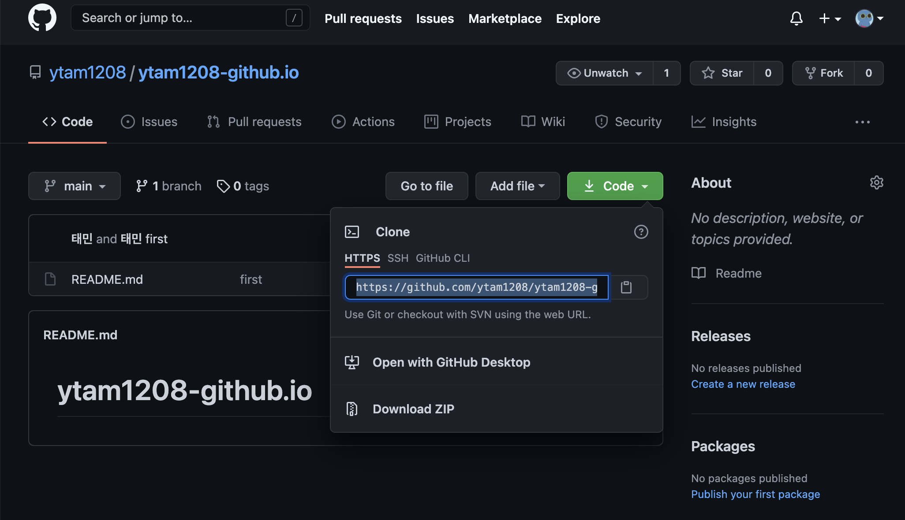

---
layout: post
title: Github 블로그 만들기(2)
subtitle: 
gh-repo: daattali/beautiful-jekyll
#gh-badge: [star, fork, follow]
cover-img: /assets/img/git_home.jpg
thumbnail-img: /assets/img/github_icon.png
share-img: /assets/img/git_home.jpg
tags: [jekyll, GitHub page]
comments: true
---  

#### Jekyll 소개

GitgubPage 제작 프로그램은 jekyll, HEXO가 가장 많이 쓰입니다. 

그 중 가장 사용자가 많은 jekyll을 선택했습니다.


## Jekyll 이란?

Jekyll은 Ruby Gem으로 제공되며 템플릿과 템플릿의 구성요소, 인라인 코드, 마크다운과 같은 동적인 구성요소를 정적인 웹페이지로 만들어주는 파싱 엔진이다.

Jekyll 공식 사이트는 [여기](https://jekyllrb-ko.github.io/)를 클릭하세요. 

###### ***홈페이지에 들어가면 한국어도 지원해서 친숙하고 새로운 기능이 추가되도 번역도 자주는 아니지만 자주 올려주네요.***


<br>

## Jekyll 설치 방법  

<br>

##### 1. 아래 명령어를 통해 현재 PC에 Ruby 버전을 확인해줍니다.
   
``` $ ruby -v # ruby 2.4.4 (2018-03-28) [x86_64-darwin18] 와 같은 형태로 버전이 출력됩니다. ```


제 pc 같은 경우에는 2.6.3 이 깔려있네요.

<br>

##### 2. 아래 명령어를 이용해 Jekyll를 설치합니다.

``` $ gem install jekyll bundler ```

<br>

##### 3. 이제 전 포스트에서 만들었었던 github.io Repository를 다운로드 합니다.



또는, 아래와 같은 명령줄을 터미널을 열은 다음 넣습니다.

```$ git clone https://github.com/username/username.github.io.git ```

~~```$ git clone https://github.com/ytam1208/ytam1208.github.io.git ```~~

제 경로는 이렇게 됩니다. Repository를 다운로드 한 후에 해당 디렉토리로 이동합니다.

```$ cd ytam1208.github.io```

<br>

##### 4. Jekyll 생성하기

전 포스트에서 생성한 index.html을 제거해줍니다.

```$ rm -r index.html ```

Jekyll을 생성합니다.

```$ sudo jekyll new ./ ```

```$ bundle install ```

이제 생성된 사이트를 열어봅시다.

``` $ bundle exec jekyll serve ```

이제 개발용 서버가 생성되고, [http://localhost:4000](http://localhost:4000)에 접속하면 생성된 사이트를 확인 할 수 있습니다.


이제 git commit, git push를 하여 내 Repository로 작성한 내용들을 github에 올려주면 실제 사이트에 적용됩니다.

###### 지금까지는 github 블로그를 생성하는 방법에 대해 작성했고, 이제 다양한 블로그 테마를 다운로드해서 적용해봅시다.
