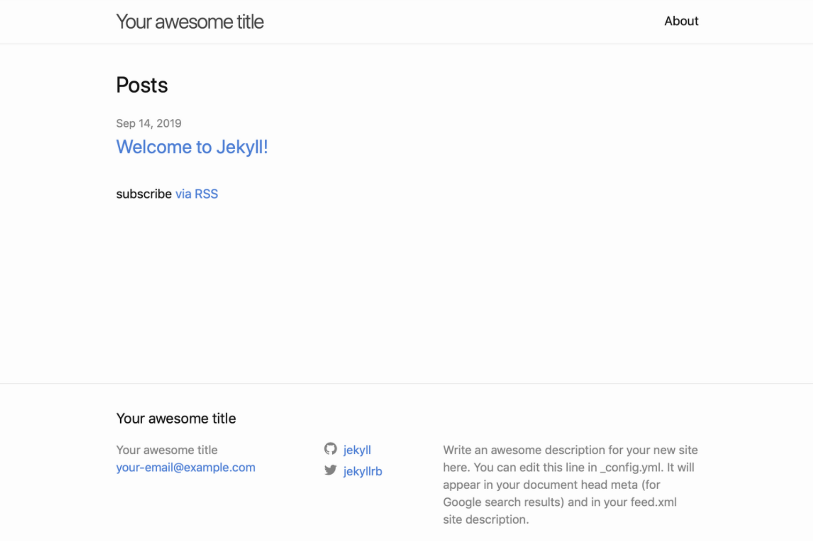
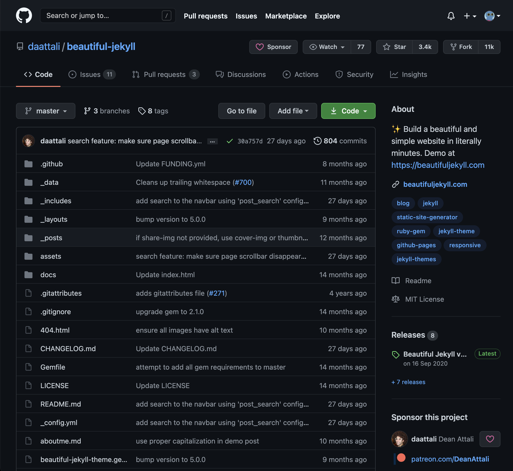
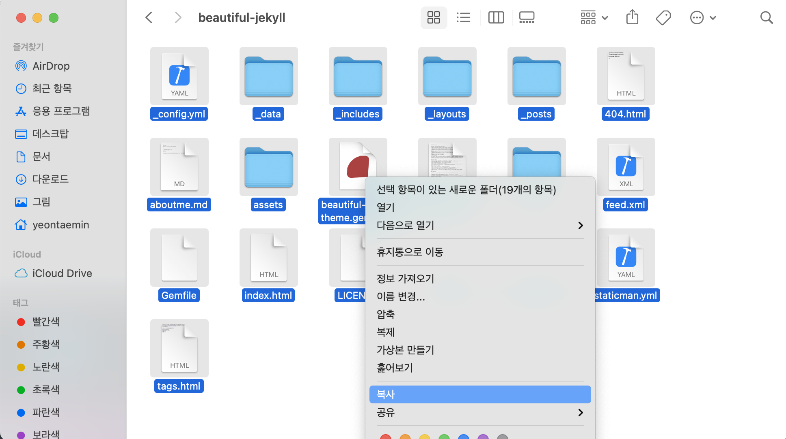
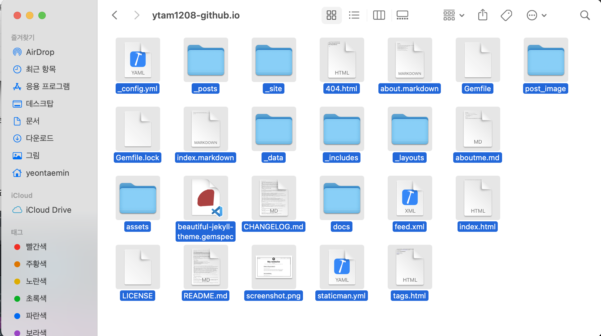

---
layout: post
title: Github 블로그 만들기(3)
subtitle: 
gh-repo: daattali/beautiful-jekyll
#gh-badge: [star, fork, follow]
cover-img: /assets/img/git_home.jpg
thumbnail-img: /assets/img/github_icon.png
share-img: /assets/img/git_home.jpg
tags: [jekyll, GitHub page]
comments: true
---  

지난 글에서 Github.io를 생성하고 Jekyll을 설치하고 실행하는 단계까지 진행했습니다.

이번에는 테마를 적용하고 새로운 글을 작성하는 방법을 확인해보겠습니다.

### 1. 테마 적용하기
처음 Jekyll을 실행하면 기본적으로 제공하는 기본 테마 페이지를 보여줍니다.



###### ***이 기본 테마도 훌륭하지만..만약 기본 테마가 마음에 든다면 이 포스트를 조용히 닫아주세요.***
###### ***하지만 새로운 테마를 적용하고 싶다면, 아래 몇 가지 단계를 거치면 손쉽게 테마를 바꿀 수 있습니다.***

<br>

### 2. 테마 다운로드하기
###### 1. GitHub에는 훌륭한 여러 테마가 공개되어 있습니다. Jekyll-theme 사이트는 [여기](https://github.com/topics/jekyll-theme)를 클릭하세요. 


이후 마음에 드는 테마를 고른 뒤 소스를 다운로드 합니다. (저는 이 테마가 마음에 드네요)



``` git clone https://github.com/daattali/beautiful-jekyll.git ```

<br>

### 3. 테마 복사하기
다운로드 한 폴더에 들어가 모든 파일을 복사 한 후 내 폴더에 붙여넣기를 합니다.



##### 겹치는 항목이 있다면 덮어쓰기를 해주세요.



이후에 테마에 필요한 플러그인을 설치해줍니다.

``` $ bundle install ``` 

이제 로컬 서버를 열어봅시다.
``` $ bundle exec jekyll serve```

[http://localhost:4000](http://localhost:4000)

### 4. 배포하기
지난번과 마찬가지로 git commit, git push 하여 github 사이트에 업로드를 하면 실제 사이트에 반영됩니다.
