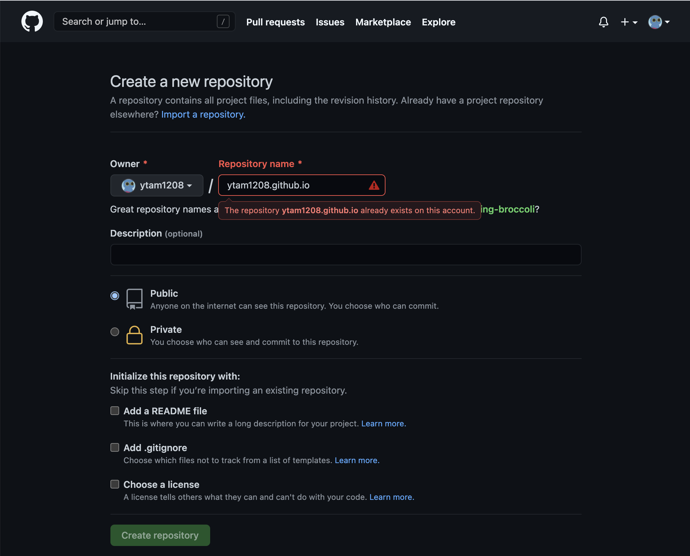
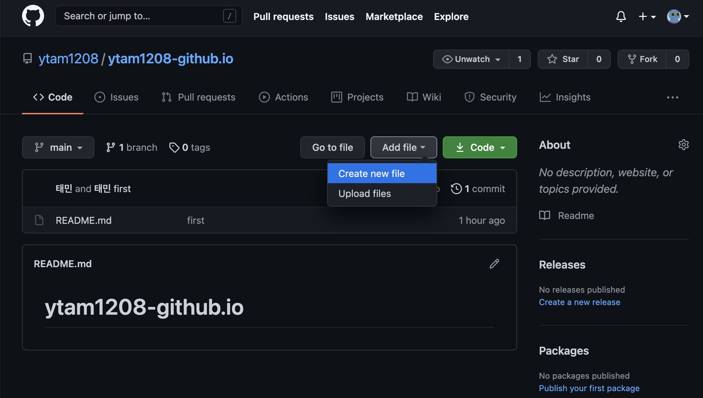
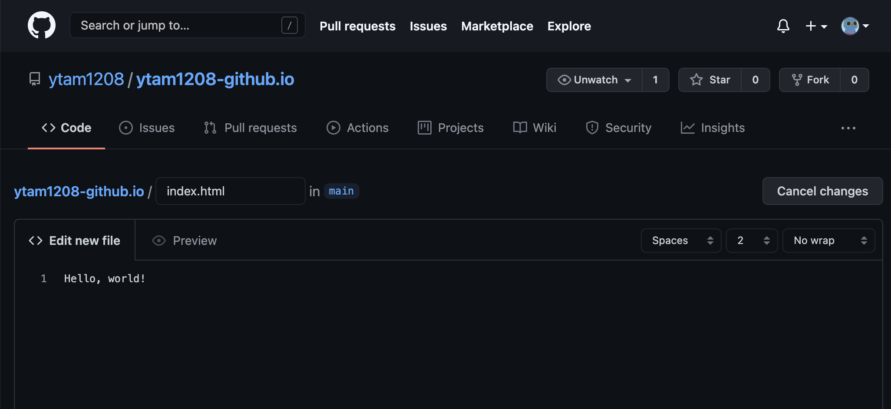
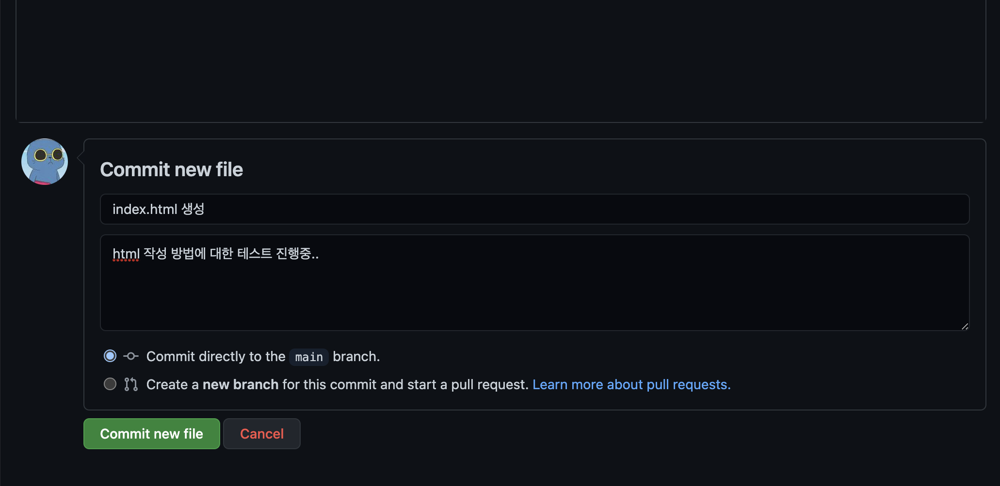

---
layout: post
title: Github 블로그 만들기(1)
subtitle: 
gh-repo: daattali/beautiful-jekyll
#gh-badge: [star, fork, follow]
tags: [jekyll, GitHub page]
comments: true
---  
##### 이 글에서는 간단하게 GitHub에 블로그를 만들어서 운영하는 방법을 알아봅니다.
1. GitHub Pages 만들기
   
        Repository 생성

        먼저 username.github.io 형태의 Repository를 생성합니다.
를
        예를 들어 GitHub ID가 ytam1208 이라면 ytam1208.github.io로 이름을 지어주면 됩니다.

2. git blog에 Hello, World! 출력해보기

                우선, Create new file 을 눌러서 index.html을 생성합니다.

                파일 이름은 index.html로 만들고, 내용은 Hello, world!을 입력해줍니다.

                commit log를 작성 후  commit new file!!

이후에 URL 창에 username.github.io에 접속하면 Hello, wolrd!가 표시됩니다.

### 이제 다음 포스트에서 본격적으로 jekyll를 사용하여 github blog를 만들어봅시다.
